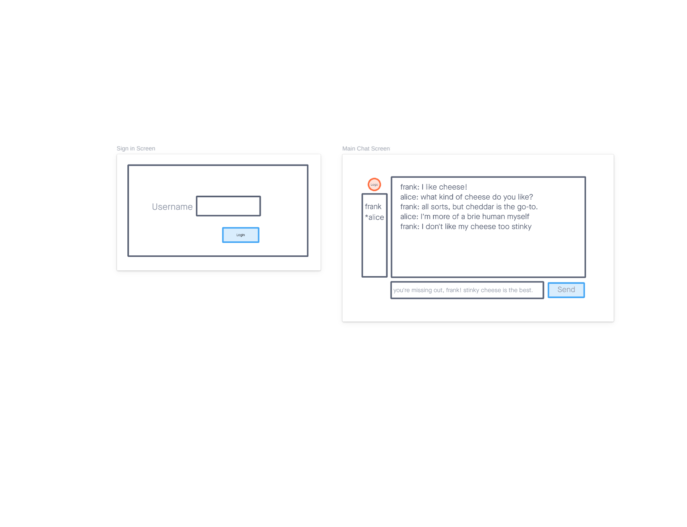
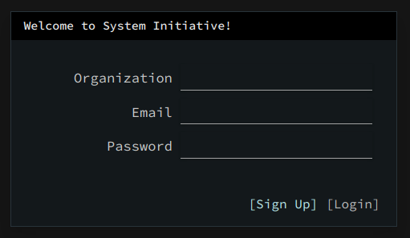

# Software Engineer III (Frontend Focused) Take Home Assessment 

This is the repository for the System Initiatives Software Engineer III (Frontend Focused) take-home assessment. It is designed to verify:

* That you have a proficiency with Vue, Tailwind and Typescript
* That you can design and implement a UI/UX from a small design example and a brief
* That you can architect a working system from a small design brief and working backend

We use a take-home assessment so that you can have your most productive environment at hand. Use whatever editor, operating
system, etc. you like. Google to your hearts content.

We expect this assessment to take no more than 4 hours to do.

## What you'll be building

We want you to build a realtime chat application. Users will sign in and chat with one another, with messages delivered in 
real time to each other. A successful implementation will allow two separate browser tabs to sign in as different users, and 
chat with each other. New users who sign in should see the previous chat history.

The application should have two primary screens; a Sign In screen and a Main Chat screen.

Please design the UI to match this aesthetic sample:

## How you'll be building it

We want you to build the frontend in [Vue.js](http://vuejs.org), specifically
Vue 3, Vite, and the [Composition API](https://v3.vuejs.org/guide/composition-api-introduction.html). Your code
must use [Typescript](http://typescriptlang.org). It must use [Tailwind](http://tailwindcss.com) for CSS.

The backend is written in Rust, with a documented API for the tasks you'll need to accomplish the assessment.
You are free to use whatever patterns you choose for implementing the frontend, but we expect you to call the
provided backend API. 

You are free to use any state libraries you want; but extra points if you use [RxJS](https://rxjs.dev/), as
it is what we use.

Additionally, we would like (at least) one test for your implementation. We use [Cypress](https://cypress.io), but
we would be happy with either Cypress style end-to-end tests or with Vue component level tests, in whatever framework
makes sense to you.

Include a README that tells us how to run your application, how to run your tests, and any additional improvements
you might make if you had additional time.

When you've finished, create a repository on Github and send us the link. If you prefer to keep it private,
you can add `adamhjk`, `fnichol`, `alex-init`, and `mahirl` as collaborators. 

## How to run the backend

